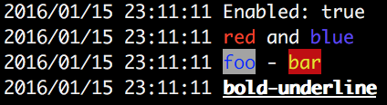

# cc

[](https://godoc.org/github.com/d5/cc)

Colorize terminal output.

```golang
package main

import (
	"log"
	"github.com/d5/cc"
)

func main() {
	log.Printf("Enabled: %v", cc.Enabled())
	log.Printf(cc.Red("red") + " and " + cc.Blue("blue"))
	log.Printf("%s - %s", cc.BgWhite(cc.Blue("foo")), cc.BgRed(cc.Yellow("bar")))
	log.Printf(cc.Underline(cc.Bold("bold-underline")))
}
```



## Features
- Clean and simple API
- Windows support
- Auto-detect coloring support

## Install

```bash
go get github.com/d5/cc
```
